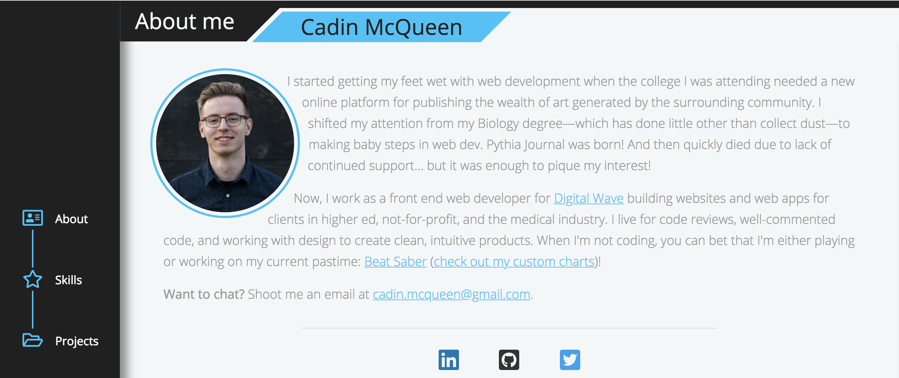

# Cadin McQueen's Portfolio

This portfolio was built from scratch using jQuery and Sass and features my contact information, skills, and a few notable projects.

To get started using this page as a template, you'll need to intall Sass. I used [this guide](https://www.taniarascia.com/learn-sass-now/) to get Sass running on my system and used the stylesheet architecture it recommends. Most notably, I wanted to use Sass to make use of mixins, variables, and compilation for a maintainable codebase. In order to compile, use the command `sass --watch sass:css --style compressed` to target the `sass` directory and compile it to the `css` directory in a compressed format.